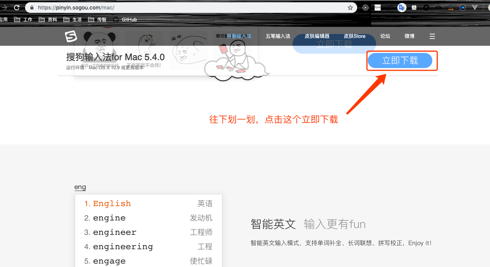
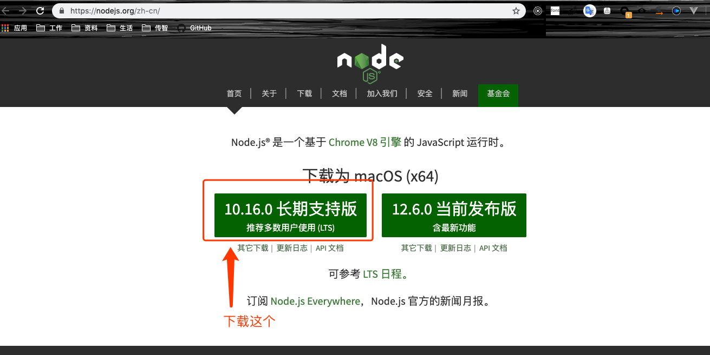
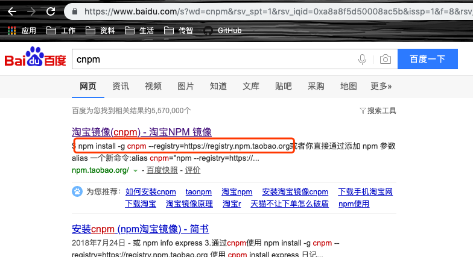

::: tip
记录每一天，留给还没有入职的你们
:::

<!-- more -->
> 因为每个公司都不一样，我只能说自己，有啥出入，莫怪哈
## 第一件事
> 自然就是、签合同、个人信息、社保、保密协议
**注意事项**
* 合同好好看看，主要是工资啊，实习期，实习期时的工资，社保，一些补助啥的，反正跟钱有关的就很重要，我是这么认为的。
* 社保怎么上，五险一金交多少。因为我是有北京社保的所以就不知道没有社保的情况
* 还有就是本科学历啥的，最好有，如果有精力最好在整一个自考本啊，函授啥的，还是有用的，（HR老哥跟我说的，因为开发的门槛越来越高了）
## 领电脑找工位
> 今天碰见了一件尴尬的事情
* 如果公司有mac，建议还是使用mac本，毕竟看着顺眼，别说不会用，（百度啥都有，包括怎么在mac上面创建文件夹）
* 今天去领笔记本，是一个mac本，我也就没问，结果打开一看，我靠，window开机界面就来了，顿时傻眼，不会用win10系统，我就问有没有mac系统的，他说有我果断换了，（还是习惯了，你们还是习惯一下mac，用着还不错的，装环境也方便）
* 如果mac真心用不惯，那就用windows系统吧，毕竟不能影响开发不是
* 工位就随便了，坐哪都行，让坐哪坐哪，以后他可能会在调整的，这个无所谓了
## 装环境
> 打开公司配的笔记本，那叫一个干净，我们想要的一个都没有，没关系我们自己下去。（有的公司会有之前上一个同事配好的环境，你只是需要查一下对应的版本就可以了）
1. `谷歌浏览器` 打开你桌面的浏览器，`IE`也好，`360`也罢,百度谷歌浏览器，去**官网**下载。
[谷歌官网](https://www.google.cn/intl/zh-CN/chrome/)
2. `输入法` 电脑自带的输入法太难用了，我会下载一个自己的输入法，这个时候就可以打开`谷歌浏览器`了，如果谷歌没下好，那你接着用那些垃圾浏览器去下载你常用的输入法就好了,我最常用的是`搜狗输入法`,这个没有啥好不好，看你用哪个顺手了。
[搜狗输入法](https://pinyin.sogou.com/mac/)

**记住下载输入法，别下载什么表情斗图啥的**
3. `node`百度node，下载稳定版，不要下载最新版，啥是稳定版，啥是最新版，进入官网左边的那个，版本低的那个就是稳定版，右边那个，版本高的那个就是最新版[node官网](https://nodejs.org/zh-cn/)

**安装的时候注意，mac的不用管直接下一步就好了，windows系统的一定要装在c盘，一定要**
> 安装完node一定要打开控制台查看一下版本
`node -v` 和 `npm -v`
**都能显示对应的版本，那就没有问题，这步基本都没有问题**
4. `cnpm`我们都知道`npm`下载包是从国外的地址下载的，这样导致下载很慢或者下载失败，我们需要下载`cnpm`，cnpm是淘宝镜像，国内的下载快，十分钟同步一次，基本就是最新的。百度cnpm，直接copy命令到控制台回车
`npm install -g cnpm --registry=https://registry.npm.taobao.org`

5. `git` 我是下载的git，有的公司可能用`svn`，svn很简单，直接下载一个`svn小乌龟`，啥不知道，那你自己百度查查，简单的都懒得说。git命令都没问题了吧，有问题也没有关系vscode上就能解决，不行就下载`sourcetree`
[git下载地址](https://git-scm.com/downloads)
6. `vscode` [编译器](https://code.visualstudio.com/)
需要自己下载插件，如果不会就带个U盘，直接将你现在的插件导进去，具体怎么操作明天后天有时间再说吧。
7. 如果是vue开发你还需要下载`vue-cli`看你自己
`cnpm i -g @vue/cli`,[vue-cli](https://cli.vuejs.org/zh/guide/installation.html)
8. `在线流程图`,自己有画图工具就更好了，因为有些流程走不通了，可以去写写画画，捋顺一下就通了，
[在线流程图](https://www.processon.com/)

9. 剩下的就看自己需求了，什么`有道词典` `网易云音乐` `ps`最好找到破解版的，因为不会抠图随意我就没有安装，剩下的就看工作需要，然后自己去网上找就行了，网上教程很多
## 看项目，具体怎么看明天再说
拜拜了
