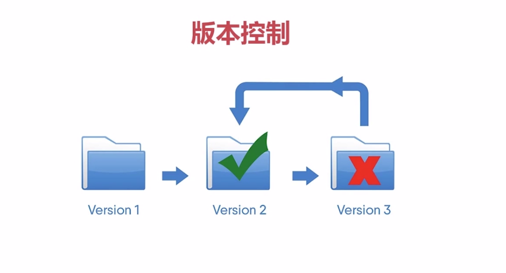
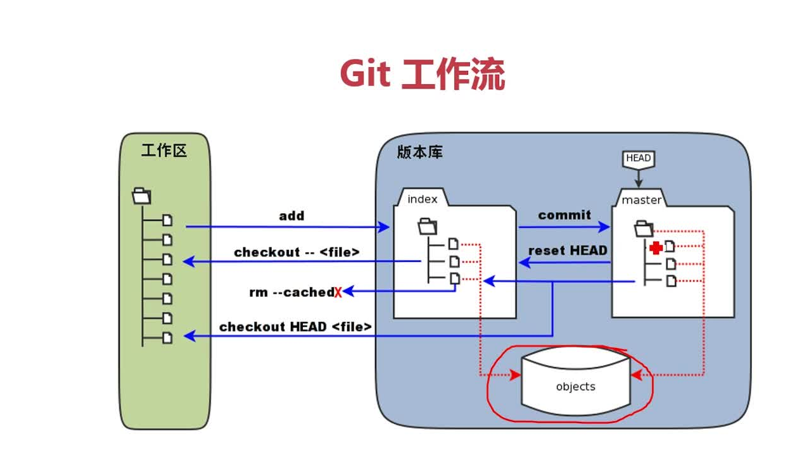
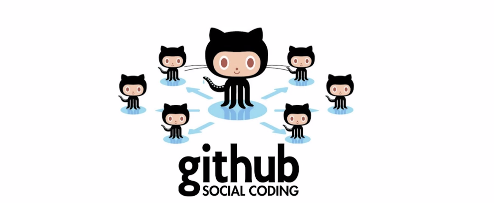
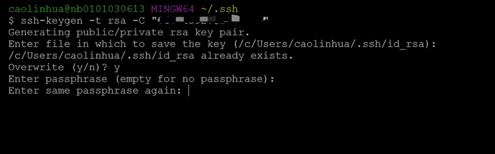
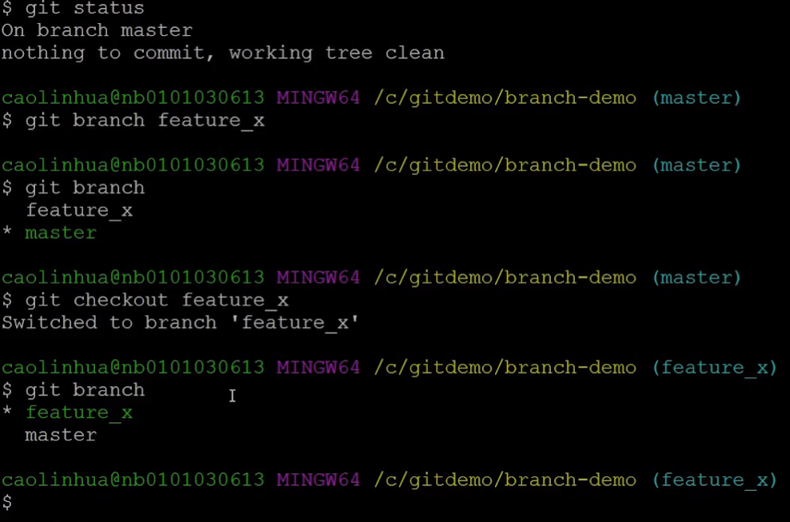
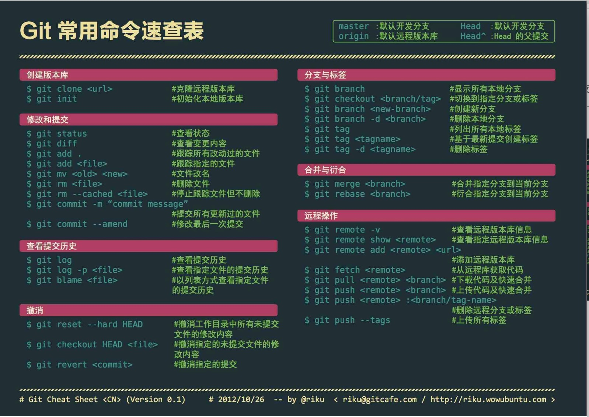

::: tip
工作中git的简单使用
:::
<!-- more -->

## 版本控制

## 为什么学习git

* 牛逼的互联网，牛逼的大神们都在用
* 完整的版本控制功能，解决多人协作的问题
* 提高开发效率
* 如果你是程序猿，请务必学git，并习惯把自己的代码同步到github
* git不等于github大家注意了，git和github就是球和球场的关系

## 课程介绍

* git 安装
* git 工作流
* 本地与远程仓库
* 分支管理
* 标签管理

## git安装

- 下载 git

  ——  Msysgit `https://git-scm.com/downloads`

- 鼠标右键打开找到 git Bash（有的同学右键没有，没有关系，打开一个文件夹，右键有git Bash也是👌的）

- 配置用户信息（输入命令什么都没有显示就是没有错的）

  ——  `git config --global user.name 'TankRyze'`  （添加用户名）

  ——  `git config --global user.emial '15732451723@163.com'`  （用户邮箱）

  —— `git config --list `  (查看我们有没有配置成功)

- 客户端UI界面

  —— [sourcetree](<https://www.sourcetreeapp.com/>)

## git 仓库

* 又名`版本库` 可以理解为目录(新建一个文件夹)

  —— 显示隐藏文件

* 初始化版本库

  —— `git init`

* 添加文件到版本库

  —— `git add ` (提交暂存区)

  ​	—— `git add .` 添加所有文件

  ​      ——  `git add XX.html` 添加指定文件

  —— `git commit` （提交本地版本库）

  ​	—— `git commit -m '描述信息'`

* 查看仓库状态

  —— git status

  **sourcetree演示，命令行演示**

## git 其他常用命令

* `pwd` 显示我当前在哪个目录下面
* `ll`  显示文件详细信息 （mac上没有这个命令可以用`ls`）
  * `ls -a` 显示所有文件
* `cd` 进入文件夹 （进入上一级目录`cd ..`）
* `mkdir` 创建文件夹
* `rm -r 文件名` 删除文件夹
* `clear` 清理当前目录
* `cat XX.txt` 打开文件

## git 工作流

模拟工作场景（产品经理（老何）提个需求过来，我们如何进行实战开发）

* sourcetree演示

  —— 打开`scourcetree`

  —— 打开项目

  ——  文件状态

  —— 输入提交信息 提交

  —— 查看历史

  —— 查看我们提交的文本 右键 提交回滚

* git 命令行

  —— `git init`

  —— 第一天的需求

  —— `git add .`

  ——  `git commit -m '描述信息'`

  —— `git status` （查看状态）

  —— 下班前，我们产品经理（老何）又提了一个临时需求

  —— 修改代码

  —— `git add .`(收拾东西回家)

  —— 又说修改不需要了，。。。。。

  ——`git reset HEAD .` （将暂存区的文件回滚）

  —— `git checkout -- .` (将我们的工作去变得干净，就是昨天写完提交的代码全部干掉,开始新的开发)

  —— 我们将代码保存在版本库的时候，准备回家，产品经理（老何）又说今天的需求不做了。。。。。

  —— `git log` 查看commit提交的信息（找到commit号）

  —— `git reset --hard 8c5abb0af6e9bd1cc21ade178e1ec41cc6670b65(我们要回滚的commit号) `(进行回滚 --hard 指我们的最终仓库和我们的暂存序列文件都进行一个回滚)

  —— 项目不做了

  —— 直接找到文件夹，删除所有文件

  —— `git add .`

  —— `git commit -m '描述信息，项目终止'`

  

##  远程仓库

- 创建github账号

- 创建 SSH key

  —— `ssh-keygen -t rsa -C "github的注册邮箱"`

  

- 找到公钥

  —— `cat /Users/liushuai/.ssh/id_rsa.pub`

- 判断我们是否与`github`联通

  —— `ssh -T git@github.com`  (出现Hi github昵称! You've successfully authenticated, but GitHub does not provide shell access.链接成功了)

- 添加远程仓库

  —— `git remote add origin https://github.com/TankRyze/demo.git ` （https://github.com/TankRyze/demo.git 我新建的远程仓库地址）(这个相当于给我们的远程仓库起一个小名)

  —— `git pull origin master`

  —— `git push -u origin master`（-u的命令就是把本地master分支与远程关联上去，第二次不需要）

  **演示sourcetree远程推送**

- 克隆仓库

  —— `git clonehttps://github.com/TankRyze/demo.git ` （就是将我们的远程仓库保存在本地）

## 标签管理

在日常工作中我们需要发布一个新的版本打一个标签，这样我们就确定了该标签的版本时刻，以后再某一个时刻我们想回滚到当前版本，我们就可以通过标签取出来，我们想回滚上一个版本是通过标签，而不是通过分支。

* 标签管理的命令

  —— `git tag` (查看所有标签)

  —— `git tag name` (创建标签)

  —— `git tag -a name -m "commit" `(指定提交信息)

  —— `git tag -d name` (删除标签)

  —— `git push origin name`（标签发布）

* 模拟真实场景

  —— `git clone 远程地址` 拉取项目

  —— 写完代码

  —— 进入项目文件夹

  —— `git add .`

  —— `git commit -m '前端静态页面基本完成'`

  —— `git pull origin master`(拉取代码)

  —— `git push origin master`（提交代码）

  —— `git tag`（列出当前所有的标签）

  —— `git tag v0.0.1` (创建版本标签)

  —— `git tag`（查看我们创建的标签是否成功）

  —— `git push origin v0.0.1` （将创建的标签推送到远程仓库）

  —— `git show v0.01` 查看该版本的commit

  —— `git reset --hard 8c5abb0af6e9bd1cc21ade178e1ec41cc6670b65(我们要回滚的commit号) ` 进行回滚

## 分支管理

- 我们有一个新的需求，开发时间比较长，第一周你只写了50%,你想立即提交，但是代码还没有写完，不完整的代码，会影响到别人工作，你想把所有的代码写完，然后提交，就会存在丢失每天进度和代码的风险，有了分支你就不用在害怕了，你只需要创建你自己的分支,在自己的分支上进行工作，就不会影响到别人，等你开发完之后再合并到别人的分支，这样既安全又不会影响到工作

- 命令

  —— `git branch` （查看所有分支）

  —— `git branch feature_x` （创建一个新的分支）

  —— `git checkout feature_x ` (切换分支)

  —— `git checkout -b fearure_x  ` (创建并切换到该分支)

  —— `git merge feature_x` (合并分支)（使用该命令的时候一定要知道自己在哪个分支，因为他会将feature_x分支合并到你当前所在的分支）

  —— `git branch -d feature_x` （删除分支）

  

## 总结

* 介绍和安装

* 工作流       工作区  ==> 暂存区  ===>  版本库

* 初始化        git init  ==> git add ===>  git commit

* 远程仓库    git remote add ==> git pull ===> git push ====> git clone

* 分支管理    git branch  ==> git checkout ===> git merge

* 标签管理    git tag  ==> git push

[廖雪峰大神个人网站](https://www.liaoxuefeng.com/wiki/896043488029600)

